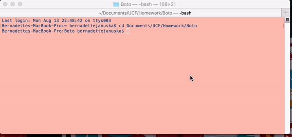

# Boto
Console/ Terminal "bot" that runs simple little tasks

Ask it for a movie and it will return with the 
       * Title of the movie.
       * Year the movie came out.
       * IMDB Rating of the movie.
       * Rotten Tomatoes Rating of the movie.
       * Country where the movie was produced.
       * Language of the movie.
       * Plot of the movie.
       * Actors in the movie.

Ask it for a song and it will return 
	 * Artist(s)
     * The song's name
     * A preview link of the song from Spotify
     * The album that the song is from

If your wonderful song does not show up, the bot will recommend a song for any special occasion. ; )

Ask it for tweets and it will pull up the most recent 20 tweets from the account it is tied to
